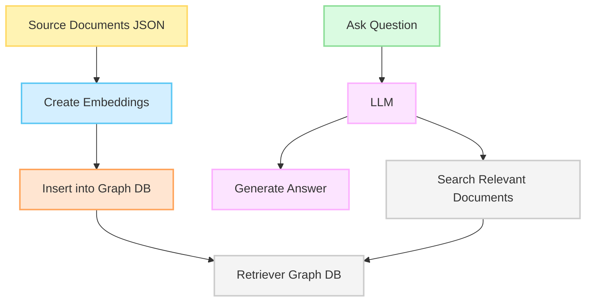
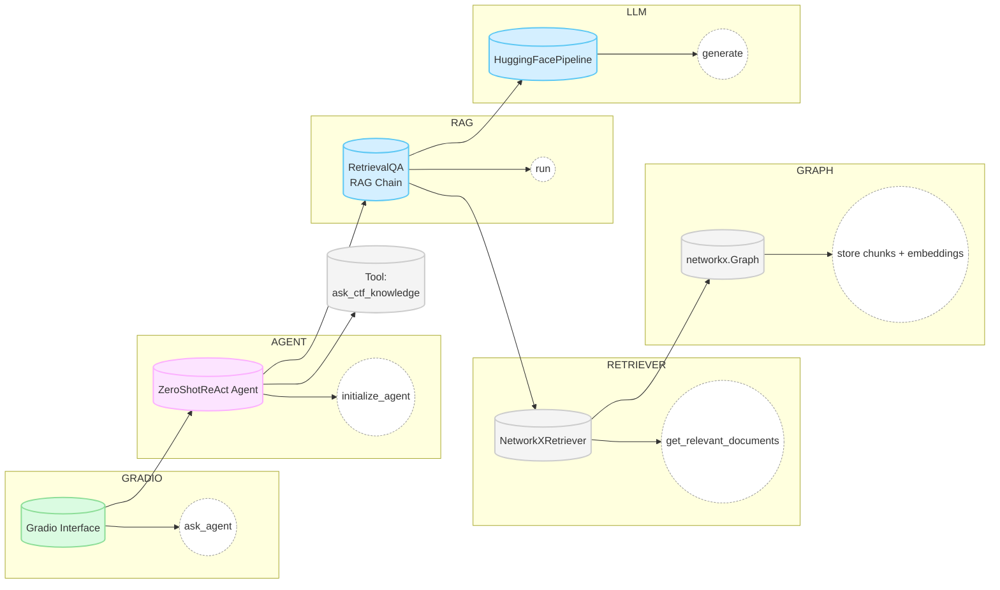

# Senade_llm_agent

# Проект: Атакующий LLM-агент для Capture The Flag (CTF) Senade
```
senade_llm_agent/
├─ app.py               # Входная точка (main, Gradio, запуск агента)
├─ agents/
│   └─ ctf_agent.py     # init_agent, настройка ZeroShotReact, tools
├─ retrievers/
│   └─ networkx_retriever.py  # класс NetworkXRetriever
├─ models/
│   └─ llama_pipeline.py # создание LLaMA pipeline
├─ data/
│   └─ (json файлы, txt файлы, etc.)
├─ utils/
│   └─ final_answer_parser.py # StrictFinalAnswerParser
└─ requirements.txt
```

#### Логика работы


#### Пример

<pre>
  <div id="header" align="center"> 
  </div>
</pre>

## 🧠 Атакующий LLM-агент

Проект представляет собой разработку атакующего агента на базе языковой модели (LLM), специально предназначенного для решения задач в формате Capture The Flag (CTF). Атакующий агент будет анализировать систему, выявлять уязвимости и генерировать команды для эксплуатации этих уязвимостей, что позволит моделировать реальные сценарии пентестинга и улучшать защитные стратегии.

### 🎯 Цели проекта

- Создать агент на основе LLM, который будет способен анализировать текстовые данные и логи систем для поиска уязвимостей.
- Автоматизировать процесс генерации атакующих команд, эксплойтов и действий для выполнения CTF-задач.
- Моделировать автономные атаки в симулированной инфраструктуре с использованием наборов данных CTF.
- Оптимизировать тренировки пентестеров и тестирование систем безопасности.

### 🔑 Ключевые функции

1. **Анализ уязвимостей:**
   - Обучение модели для выявления паттернов уязвимостей в текстовых логах, системных сообщениях и сетевых данных.
   - Определение точек повышения привилегий и системных ошибок.

2. **Генерация атакующих команд:**
   - Создание атакующих скриптов и команд на основе анализа входных данных.
   - Автоматическая генерация эксплойтов для выполнения атак CTF, включая SQL-инъекции, обход аутентификации и повышение привилегий.

3. **Автономное выполнение атак:**
   - Автоматизация процесса выполнения атак в симулированной ИТ-среде (виртуальные машины, контейнеры).
   - Оценка успешности атак с возможностью обратной связи и обучения модели.

4. **Адаптация к новым сценариям:**
   - Адаптивное обучение на основе результатов атак, корректировка стратегии в зависимости от поведения защищаемой системы.
   - Возможность добавления новых типов атак и уязвимостей через обучение модели на дополнительных данных.

### 🛠 Технологии

- LLM: llama3.1-8b-instruct +  llama3.2-1b-instruct
- Фреймворк: Gradio
- База данных: граф NetworkX


  #### Архитектурная цепочка


### 🚀 TODO

- Интеграция с внешними инструментами: анализатор кода, портов и тд
- Подключение более сильных моделей - GPT, Claude и тд.
- Обогащение датасета


---

Создано для того, чтобы помочь пентестерам и специалистам по безопасности моделировать и изучать реальные сценарии атак.
